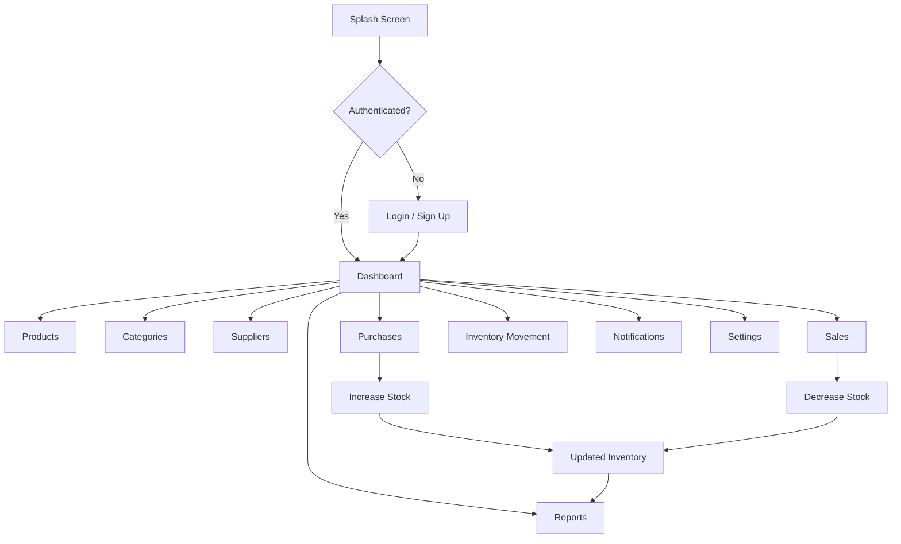
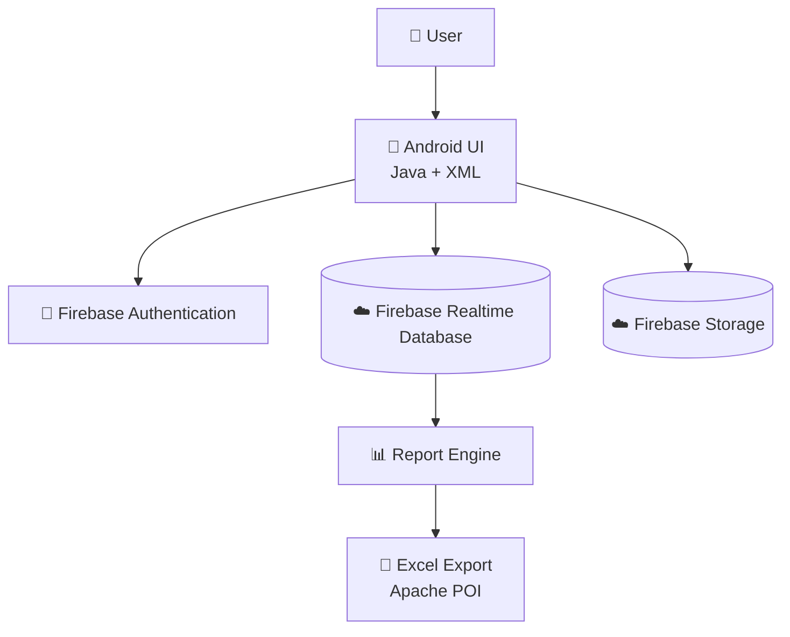
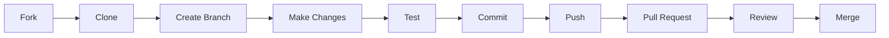

<div align="center">

# 📦 Smart Shelf

### Inventory Management System for Android

<p>
  
  
  
  
</p>

<p>
  
  
  
  
  
</p>

<p>
  <strong>📦 Products</strong> ·
  <strong>🛒 Purchases</strong> ·
  <strong>💰 Sales</strong> ·
  <strong>🚚 Suppliers</strong> ·
  <strong>📊 Reports</strong> ·
  <strong>🔔 Alerts</strong>
</p>

<p><i>Manage inventory smarter — from products and stock to purchases, sales and business reports.</i></p>

</div>

---

## 🎬 App Preview

> **Add your real demo GIF here:** `docs/assets/smart-shelf-demo.gif`

<p align="center">
  
</p>

<details>
<summary>📸 No GIF yet? Use the screenshot gallery below</summary>

Add your screenshots inside `docs/assets/` and keep the filenames below.

| Authentication | Dashboard | Products |
|---|---|---|
|  |  |  |

| Purchases | Sales | Reports |
|---|---|---|
|  |  |  |

</details>

---

## 🧭 Contents

- [✨ About Smart Shelf](#-about-smart-shelf)
- [🎯 Project Goals](#-project-goals)
- [🚀 Feature Showcase](#-feature-showcase)
- [📱 Application Flow](#-application-flow)
- [🏗️ System Architecture](#️-system-architecture)
- [☁️ Firebase Architecture](#️-firebase-architecture)
- [📊 Inventory Logic](#-inventory-logic)
- [📈 Reports & Analytics](#-reports--analytics)
- [🛠️ Technology Stack](#️-technology-stack)
- [📁 Project Structure](#-project-structure)
- [⚙️ Getting Started](#️-getting-started)
- [🔐 Security & Permissions](#-security--permissions)
- [🗺️ Roadmap](#️-roadmap)
- [🤝 Contributing](#-contributing)
- [👥 Team](#-team)
- [📄 License](#-license)

---

# ✨ About Smart Shelf

**Smart Shelf** is an Android inventory management application built with **Java + XML** and powered by **Firebase**.

The application connects everyday inventory operations in one workflow:

```text
Products
   │
   ├──────────────┐
   ▼              ▼
Purchases       Sales
   │              │
   └──────┬───────┘
          ▼
     Stock Movement
          │
          ▼
    Inventory Overview
          │
          ▼
       Reports
```

It is designed around a practical inventory workflow rather than a simple product list.

---

# 🎯 Project Goals

| Goal | Purpose |
|---|---|
| 📦 Centralize inventory | Keep products, categories and suppliers organized |
| 📥 Track incoming stock | Record purchases and update inventory |
| 📤 Track outgoing stock | Record sales and reduce available stock |
| 💰 Monitor value | Calculate current inventory value |
| 🔔 Detect low stock | Notify users about stock conditions |
| 📊 Understand activity | Provide inventory and sales summaries |
| 📄 Export data | Generate a complete Excel report |

---

# 🚀 Feature Showcase

## 🔐 Authentication

Smart Shelf provides account-based access using Firebase Authentication.

- Email/password login
- Account registration
- Password reset
- Google Sign-In
- User profile information
- Logout
- Terms & privacy acknowledgement

<details>
<summary>🔎 Authentication flow</summary>

```text
             ┌──────────────┐
             │ Splash Screen│
             └──────┬───────┘
                    ▼
             ┌──────────────┐
             │     Login    │
             └──────┬───────┘
                    │
          ┌─────────┴─────────┐
          ▼                   ▼
      Email Login         Google Login
          │                   │
          └─────────┬─────────┘
                    ▼
                Dashboard
```

</details>

---

## 📊 Smart Dashboard

The dashboard provides a quick overview of inventory activity.

### Dashboard information includes

- Total products
- Low-stock products
- Categories
- Suppliers
- Revenue
- Inventory overview
- Recent activity
- Quick actions
- Notifications

The dashboard also provides shortcuts to important operations such as:

`Products` · `Categories` · `Suppliers` · `Purchases` · `Sales` · `Reports` · `Inventory Movement`

---

## 📦 Product Management

Create and maintain detailed product records.

### Product information

- Product name
- Product ID
- Description
- Brand
- Barcode
- Category
- Cost price
- Selling price
- Stock quantity
- Product image

### Product actions

```text
➕ Add
   ↓
✏️ Edit
   ↓
👁️ View
   ↓
🗑️ Delete
```

---

## 🗂️ Category Management

Products can be organized using categories.

```text
Category
   │
   ├── Name
   ├── Description
   └── Status
```

Users can:

- Add categories
- Edit categories
- View categories
- Delete categories

---

## 🚚 Supplier Management

Maintain supplier records and connect purchases with suppliers.

Supplier information can include:

- Supplier name
- Contact information
- Email
- Phone number
- Company information

---

## 🛒 Purchase Management

Purchases represent **incoming inventory**.

A purchase can contain:

- Product
- Supplier
- Quantity
- Purchase price
- Total amount
- Purchase date
- Invoice number
- Notes

### Incoming stock flow

```text
Purchase Created
       ↓
Quantity Added
       ↓
Product Stock Updated
       ↓
Inventory Movement Recorded
```

---

## 💰 Sales Management

Sales represent **outgoing inventory**.

A sale can include:

- Product
- Quantity
- Selling price
- Customer name
- Payment method
- Total amount
- Sale date

### Outgoing stock flow

```text
Sale Created
     ↓
Stock Availability Checked
     ↓
Quantity Deducted
     ↓
Sale Recorded
     ↓
Inventory Updated
```

---

## 🔔 Smart Notifications

Smart Shelf includes an inventory notification system for stock-related alerts.

The application defines a **low-stock threshold of 10 units**.

```text
Quantity > 10
     │
     ▼
  🟢 In Stock

Quantity 1–10
     │
     ▼
  🟠 Low Stock

Quantity = 0
     │
     ▼
  🔴 Out of Stock
```

Notifications are stored for the authenticated user and can be accessed from the notification screen.

---

## 📦 Inventory Movement

Inventory Movement provides a history of stock changes.

```text
             INVENTORY MOVEMENT
                    │
          ┌─────────┴─────────┐
          ▼                   ▼
     🟢 PURCHASE          🔴 SALE
          │                   │
       +Stock              -Stock
          │                   │
          └─────────┬─────────┘
                    ▼
              Current Stock
```

This creates a traceable view of how inventory changes over time.

---

# 📱 Application Flow



---

# 🏗️ System Architecture



### Architecture layers

| Layer | Responsibility |
|---|---|
| 🎨 UI Layer | XML layouts and Android Activities |
| ⚙️ Application Layer | Inventory operations and business logic |
| 🔐 Authentication | Firebase Authentication |
| ☁️ Data Layer | Firebase Realtime Database |
| 🖼️ Media Layer | Firebase Storage / Glide |
| 📄 Reporting | Apache POI Excel generation |

---

# ☁️ Firebase Architecture

Smart Shelf organizes inventory data under the authenticated user's UID.

```text
Firebase Realtime Database
│
└── {uid}
    │
    ├── Users
    │
    ├── Products
    │
    ├── Categories
    │
    ├── Suppliers
    │
    ├── Purchases
    │
    ├── Sales
    │
    └── Notifications
```

### User-isolated data model

```text
Current Firebase User
        │
        ▼
      user.uid
        │
        ▼
   /{uid}/
        │
        ├── Products
        ├── Categories
        ├── Suppliers
        ├── Purchases
        ├── Sales
        └── Notifications
```

This structure keeps inventory records associated with the authenticated account.

---

# 📊 Inventory Logic

## 💵 Inventory Value

Smart Shelf calculates inventory value using:

```text
Inventory Value
      =
Stock Quantity × Cost Price
```

### Example

```text
Stock Quantity = 50
Cost Price     = ₹200

50 × ₹200
     ↓
₹10,000
```

---

## 📦 Stock Status

The current implementation uses:

```text
if quantity <= 0
    → Out of Stock

else if quantity <= 10
    → Low Stock

else
    → In Stock
```

---

# 📈 Reports & Analytics

The **Inventory Reports** screen brings together key business information.

### Inventory metrics

- Total products
- Low-stock products
- Out-of-stock products
- Healthy-stock products
- Current inventory value

### Sales metrics

- Sales revenue
- Products sold
- Total transactions

### Export

Smart Shelf can generate a complete **Excel report** containing inventory-related information using **Apache POI**.

```text
Firebase Data
     │
     ├── Products
     ├── Purchases
     ├── Sales
     └── Inventory Movement
              │
              ▼
        Report Processing
              │
              ▼
        Excel Workbook
              │
              ▼
             📄 .xlsx
```

---

# 🛠️ Technology Stack

<div align="center">

| Technology | Usage |
|---|---|
| ☕ **Java 11** | Android application development |
| 📱 **Android SDK 36** | Application platform |
| 🎨 **XML** | User interface |
| 🔥 **Firebase Authentication** | User authentication |
| ☁️ **Firebase Realtime Database** | Cloud data storage |
| ☁️ **Firebase Storage** | Cloud media storage |
| 🖼️ **Glide 4.16.0** | Image loading |
| 📊 **Apache POI 5.4.1** | Excel report generation |
| 🎨 **Material Components 1.12.0** | UI components |
| 🔑 **Google Play Services Auth** | Google authentication |
| 🧩 **AndroidX** | Android application framework |
| 🐙 **Git / GitHub** | Version control |

</div>

---

# 📁 Project Structure

```text
Smart Shelf
│
├── app/
│   │
│   ├── src/main/java/com/example/inventory/
│   │   │
│   │   ├── Authentication
│   │   │   ├── LoginActivity.java
│   │   │   └── SignupActivity.java
│   │   │
│   │   ├── Dashboard
│   │   │   └── DashActivity.java
│   │   │
│   │   ├── Products
│   │   │   ├── Product.java
│   │   │   ├── ProductActivity.java
│   │   │   ├── AddProActivity.java
│   │   │   └── EditProActivity.java
│   │   │
│   │   ├── Categories
│   │   │   ├── Category.java
│   │   │   ├── CategoryActivity.java
│   │   │   ├── AddCategoryActivity.java
│   │   │   └── EditCategoryActivity.java
│   │   │
│   │   ├── Suppliers
│   │   │   ├── Supplier.java
│   │   │   ├── SupplierActivity.java
│   │   │   ├── AddSupplierActivity.java
│   │   │   └── EditSupplierActivity.java
│   │   │
│   │   ├── Purchases
│   │   │   ├── Purchase.java
│   │   │   ├── IncomingPurchaseActivity.java
│   │   │   └── AddPurchaseActivity.java
│   │   │
│   │   ├── Sales
│   │   │   ├── Sale.java
│   │   │   ├── OutgoingSalesActivity.java
│   │   │   └── AddSaleActivity.java
│   │   │
│   │   ├── Inventory
│   │   │   ├── InventoryMovement.java
│   │   │   └── InventoryMovementActivity.java
│   │   │
│   │   ├── Reports
│   │   │   └── ReportActivity.java
│   │   │
│   │   ├── Notifications
│   │   │   ├── NotifyActivity.java
│   │   │   ├── NotifyHelper.java
│   │   │   └── NotifyModel.java
│   │   │
│   │   └── Utilities
│   │       └── StockUtils.java
│   │
│   └── src/main/res/
│       ├── drawable/
│       ├── layout/
│       ├── mipmap/
│       ├── values/
│       └── xml/
│
├── docs/
│   └── assets/
│       ├── smart-shelf-demo.gif
│       ├── login.png
│       ├── dashboard.png
│       ├── products.png
│       ├── purchases.png
│       ├── sales.png
│       └── reports.png
│
└── README.md
```

---

# ⚙️ Getting Started

## 1️⃣ Clone the repository

```bash
git clone https://github.com/aaryak537/Smart-Shelf.git
```

## 2️⃣ Open the project

Open the project in **Android Studio**.

## 3️⃣ Configure Firebase

Create/configure a Firebase project and connect the Android application.

The application uses Firebase services for:

- Authentication
- Realtime Database
- Storage

## 4️⃣ Check application configuration

```text
Application ID: com.example.inventory
Minimum SDK:    26
Target SDK:     36
Compile SDK:    36
Java:           11
Version:        1.0
```

## 5️⃣ Build and run

Connect an Android device or launch an emulator and run the application.

<details>
<summary>💡 Development checklist</summary>

- [ ] Firebase project connected
- [ ] Authentication enabled
- [ ] Realtime Database configured
- [ ] Storage configured if image uploads are used
- [ ] Google Sign-In configured if required
- [ ] Database rules reviewed
- [ ] App tested on Android device/emulator
- [ ] Release configuration reviewed

</details>

---

# 🔐 Security & Permissions

The application declares permissions related to its functionality, including:

- `INTERNET`
- `POST_NOTIFICATIONS`
- `READ_EXTERNAL_STORAGE` for supported older Android versions

Firebase authentication and user-specific database paths are used to associate data with the signed-in user.

> ⚠️ Never commit private credentials, API keys that must remain secret, service-account files, or production secrets to a public repository.

---

# 🗺️ Roadmap

### ✅ Current

- [x] Firebase authentication
- [x] Google authentication
- [x] Dashboard
- [x] Product management
- [x] Category management
- [x] Supplier management
- [x] Purchase management
- [x] Sales management
- [x] Inventory movement
- [x] Stock status
- [x] Notifications
- [x] Inventory reports
- [x] Excel export
- [x] Profile/settings screens

### 🔜 Possible Enhancements

- [ ] Barcode / QR scanning
- [ ] Advanced sales charts
- [ ] Low-stock customization
- [ ] Invoice generation
- [ ] More export formats
- [ ] Advanced search and filtering
- [ ] Cloud backup improvements
- [ ] Improved analytics dashboard
- [ ] Automated stock recommendations

---

# 🤝 Contributing

Contributions are welcome.

### Development workflow



### Branch example

```bash
git checkout -b feature/product-search
```

### Commit example

```bash
git add .
git commit -m "Add product search functionality"
git push origin feature/product-search
```

---

# 👥 Team

| Member | Contribution |
|---|---|
| **Aarya Kadam** | Android development, UI, Firebase integration & project development |
| **Team Member** | Development & testing |
| **Team Member** | Development & testing |

> Update this table with the final project members and their actual contributions.

---

# 📸 Adding Screenshots

Keep screenshots inside:

```text
docs/assets/
```

Recommended screenshots:

```text
docs/
└── assets/
    ├── login.png
    ├── signup.png
    ├── dashboard.png
    ├── products.png
    ├── add-product.png
    ├── categories.png
    ├── suppliers.png
    ├── purchases.png
    ├── add-purchase.png
    ├── sales.png
    ├── add-sale.png
    ├── inventory-movement.png
    ├── notifications.png
    ├── reports.png
    └── settings.png
```

For the best GitHub presentation, use screenshots with the same dimensions and crop them consistently.

---

# 🧪 Testing

The repository includes Android instrumentation testing support.

```text
app/src/androidTest/
```

Testing can be expanded to cover:

- Authentication
- Product CRUD
- Purchase stock updates
- Sales stock updates
- Stock-status calculations
- Report generation
- Firebase data operations

---

# 📌 Project Information

| Property | Value |
|---|---|
| **Project** | Smart Shelf |
| **Type** | Android Inventory Management System |
| **Platform** | Android |
| **Language** | Java |
| **UI** | XML |
| **Backend** | Firebase |
| **Database** | Firebase Realtime Database |
| **Minimum SDK** | 26 |
| **Target SDK** | 36 |
| **Compile SDK** | 36 |
| **Java Version** | 11 |
| **Version** | 1.0 |
| **Package** | `com.example.inventory` |

---

# 📄 License

This project is currently developed as an educational/project application.

If this repository is later distributed as open-source software, add an appropriate license such as MIT, Apache-2.0, or another license selected by the project owners.

---

<div align="center">

## 💙 Smart Shelf

### Manage Inventory. Track Stock. Understand Your Business.

<p>
  
</p>

<i>Made with ☕ Java, 📱 Android and ☁️ Firebase.</i>

</div>
